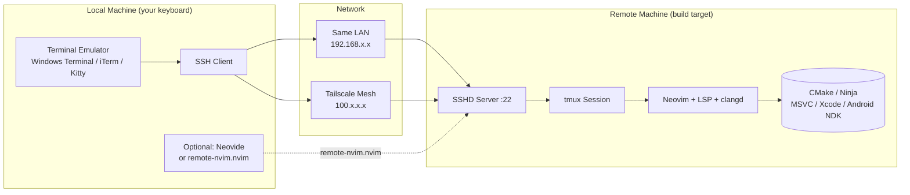

# Remote Development Master Guide

> **Unified cross-platform manual for running Neovim on a remote machine from any local OS.**  
> Covers Windows, macOS, and Linux interop. Copy-paste ready. Every step includes a verification command.

[]()
[](https://neovim.io)
[](https://github.com/tmux/tmux)

---

## What This Solves

You have **two machines** on the same desk, same room, or same house:

| Machine Role | Typical OS | Why it is the target |
|--------------|------------|---------------------|
| **Workstation / PC** | Windows 11, WSL2, or native Linux | Raw CPU power, NVIDIA GPU, large RAM |
| **MacBook** | macOS | Xcode, iOS builds, Apple Silicon per-core performance |
| **Linux laptop** | Ubuntu / Arch / Fedora | Native Linux toolchain, containers |
| **Mini PC / NUC** | Any | Silent 24/7 build server |

You want to **edit and build on the powerful or SDK-specific machine** while sitting at the keyboard of the other.  
This guide shows the **simplest, most reliable path** for every OS combination.

---

## Path Cheat Sheet — Windows Users

| Shell / Environment | `~` expands to | `~/.ssh/` equivalent | Notes |
|---|---|---|---|
| **WSL2 (Ubuntu/Debian)** | `/home/<you>` | `/home/<you>/.ssh/` | Best POSIX parity; all Linux tools available natively |
| **Git Bash** | `/c/Users/<you>` | `/c/Users/<you>/.ssh/` | Ships with `ssh-copy-id`; great middle ground |
| **PowerShell** | ❌ No | `$env:USERPROFILE\.ssh\` | Native; `ssh`, `ssh-keygen` built into Windows 10+ |
| **CMD** | ❌ No | `%USERPROFILE%\.ssh\` | Not recommended for interactive use |

> **You do not need WSL2.** Windows 10 (1809+) ships a native OpenSSH client that works identically to macOS/Linux for everything in this guide. WSL2 is recommended if you want a Linux shell locally, but it is never required.

---

## Architecture



> **Core principle:** SSH is the transport. tmux is the persistence layer. Neovim runs **natively on the target**, so LSP, headers, and toolchains never cross the network.  
> The **local** machine only needs an SSH client. Nothing else.

---

## Decision Matrix

Pick your **local** OS (rows) and **remote** OS (columns). Each cell tells you the best workflow.

| Local ↓ / Remote → | 🍎 macOS | 🐧 Linux (native) | 🪟 Windows (native) | 🪟 Windows (WSL2) |
|---|---|---|---|---|
| **🍎 macOS** | `ssh` + `tmux` | `ssh` + `tmux` | `ssh` + `tmux` | `ssh` + `tmux` |
| **🐧 Linux** | `ssh` + `tmux` | `ssh` + `tmux` | `ssh` + `tmux` | `ssh` + `tmux` |
| **🪟 Windows (PowerShell / Git Bash)** | `ssh` + `tmux` | `ssh` + `tmux` | `ssh` + `tmux` | `ssh` + `tmux` into WSL2 |
| **🪟 Windows (WSL2)** | `ssh` + `tmux` from WSL2 | `ssh` + `tmux` from WSL2 | `ssh` into sibling WSL2 | `ssh` into sibling WSL2 |

**The answer is always `ssh` + `tmux`.** Every modern OS ships an SSH client. No plugins required. No port forwarding. No GUI forwarding latency. tmux survives Wi-Fi drops and laptop sleeps.

> **Why tmux?** It runs on the **remote** machine. Your local Windows machine does **not** need tmux installed.

---

## Phase 0 — One-Time Prerequisites

Run these once on **each** machine that will participate.

### 🍎 macOS (both local and remote)

```bash
# 1. Xcode command-line tools (provides git, clang, ssh, sshd)
xcode-select --install

# 2. Homebrew
/bin/bash -c "$(curl -fsSL https://raw.githubusercontent.com/Homebrew/install/HEAD/install.sh)"

# 3. Core tools
brew install neovim git cmake ninja fzf fd ripgrep lazygit tmux nmap

# 4. Verify
nvim --version | head -1
tmux -V
ssh -V
```

> Verification output should look like:
> ```
> NVIM v0.10.x
> tmux 3.x
> OpenSSH_9.x
> ```

### 🐧 Ubuntu / Debian / WSL2

```bash
# 1. Update base system
sudo apt update && sudo apt upgrade -y

# 2. Core toolchain
sudo apt install -y neovim git cmake ninja-build fzf fd-find ripgrep tmux \
    curl wget openssh-client openssh-server iproute2

# 3. lazygit (follow official if apt version is stale)
LAZYGIT_VERSION=$(curl -s "https://api.github.com/repos/jesseduffield/lazygit/releases/latest" | grep -Po '"tag_name": "v\K[^"]*')
curl -Lo lazygit.tar.gz "https://github.com/jesseduffield/lazygit/releases/latest/download/lazygit_${LAZYGIT_VERSION}_Linux_x86_64.tar.gz"
tar xf lazygit.tar.gz lazygit
sudo install lazygit /usr/local/bin

# 4. Verify
nvim --version | head -1
tmux -V
ssh -V
```

### 🪟 Windows Local — Native Path (PowerShell / Git Bash)

Windows 10 (1809+) and Windows 11 ship OpenSSH by default. You do **not** need WSL2 for SSH remote development.

#### PowerShell (native)

```powershell
# 1. Verify OpenSSH client is present (built-in on Win10 1809+)
Get-WindowsCapability -Online | Where-Object Name -like 'OpenSSH*Client*'

# If "NotPresent", install:
Add-WindowsCapability -Online -Name OpenSSH.Client~~~~0.0.1.0

# 2. Optional but recommended: Windows Terminal (Microsoft Store or winget)
#    for Unicode, font ligatures, and tmux key-chord passthrough.

# 3. Verify
ssh -V
```

#### Git Bash (from Git for Windows)

```bash
# 1. Download and install Git for Windows
#    https://git-scm.com/download/win

# 2. Open Git Bash. It provides ssh, ssh-keygen, ssh-copy-id, scp, rsync (via pacman).

# 3. Verify
ssh -V
```

> **Tip:** Git Bash understands POSIX paths (`~/.ssh/` expands to `/c/Users/<you>/.ssh/`) and includes `ssh-copy-id`, making it the smoothest native-Windows option if you do not want WSL2.

### 🪟 Windows Local — WSL2 Path (optional)

Use this if you prefer a Linux shell and ecosystem on your Windows machine.

```powershell
# 1. Install WSL2 + Ubuntu
wsl --install -d Ubuntu

# 2. Open Windows Terminal → Ubuntu tab
# 3. Run the 🐧 Ubuntu section above inside WSL2
```

---

## Phase 1 — Discover the Remote IP

Run **on the remote machine** (the one you will SSH into):

<table>
<tr><th>OS</th><th>Command</th><th>Expected output</th></tr>
<tr>
<td>🍎 macOS</td>
<td><code>ipconfig getifaddr en0</code></td>
<td><code>192.168.1.42</code></td>
</tr>
<tr>
<td>🐧 Linux / WSL2</td>
<td><code>hostname -i | awk '{print $1}'</code></td>
<td><code>192.168.1.42</code></td>
</tr>
<tr>
<td>🪟 Windows (PowerShell)</td>
<td><code>(Get-NetIPAddress -AddressFamily IPv4 | Where-Object { $_.IPAddress -match "192\.168" }).IPAddress</code></td>
<td><code>192.168.1.42</code></td>
</tr>
<tr>
<td>🪟 Windows (CMD)</td>
<td><code>ipconfig | findstr "192.168"</code></td>
<td><code>192.168.1.42</code></td>
</tr>
</table>

> **Note:** `en0` is Wi-Fi on most Macs. If on Ethernet, try `en1` or run `ifconfig` to find the active interface.

**Verify reachability from the local machine:**

```bash
# macOS / Linux / WSL2 / Git Bash
ping -c 4 192.168.1.42
```

```powershell
# Windows PowerShell
ping -n 4 192.168.1.42
```

All packets should reply. If they do not, both machines are likely on different subnets or Wi-Fi bands (e.g., 2.4 GHz vs 5 GHz guest isolation). Use Tailscale (Phase 7) to bypass this entirely.

---

## Phase 2 — Enable the SSH Server on the Remote

### 🍎 macOS Remote

```bash
sudo systemsetup -setremotelogin on

# Verify
sudo launchctl list | grep com.openssh.sshd
# or
sudo ss -tlnp | grep :22
```

Expected: `tcp LISTEN 0 128 *.22 *.*`

### 🐧 Linux / WSL2 Remote

```bash
sudo apt install -y openssh-server
sudo systemctl enable ssh --now   # native Linux
sudo service ssh start            # WSL2 (no systemd)

# Verify
sudo ss -tlnp | grep :22
```

Expected: `0.0.0.0:22` or `:::22`.

<details>
<summary><b>🛠️ WSL2 fix: SSH only bound to 127.0.0.1</b></summary>

If `ss` shows `127.0.0.1:22`, Windows cannot reach it from another machine.

```bash
echo "ListenAddress 0.0.0.0" | sudo tee -a /etc/ssh/sshd_config
sudo service ssh restart
sudo ss -tlnp | grep :22
```
</details>

### 🪟 Windows Native Remote

If the remote is native Windows, install OpenSSH Server:

```powershell
Add-WindowsCapability -Online -Name OpenSSH.Server~~~~0.0.1.0
Start-Service sshd
Set-Service -Name sshd -StartupType 'Automatic'

# Verify
Get-NetTCPConnection -LocalPort 22 -State Listen
```

> **Windows as a remote build target is valid and powerful.** Install Neovim via [scoop](https://scoop.sh) or [chocolatey](https://chocolatey.org) on the Windows remote, then use MSVC, clang-cl, or MinGW exactly as you would locally. The only difference is that `clangd` on Windows needs the same `compile_commands.json` as on Linux (see Phase 5.2).

---

## Phase 3 — First Connection & Passwordless Auth

All commands below run on the **local machine**.

### Step 3.1 — First login (password)

```bash
# Replace 'your_username' and '192.168.1.42' with real values
# your_username = output of `whoami` on the REMOTE machine
ssh your_username@192.168.1.42
```

Type `yes` when asked to trust the host fingerprint. Enter the remote user's password.

**Verify:** the prompt changes to the remote hostname. Run `hostname` and `whoami`.

### Step 3.2 — Generate an SSH key (once per local machine)

**macOS / Linux / WSL2 / Git Bash:**

```bash
ssh-keygen -t ed25519 -f ~/.ssh/id_devbox -N ""
```

**Windows PowerShell (native):**

```powershell
# Default path is %USERPROFILE%\.ssh\id_ed25519
# Use a custom name to avoid clashing with other keys:
ssh-keygen -t ed25519 -f "$env:USERPROFILE\.ssh\id_devbox" -N '""'
```

This creates:
- Private key — never leaves this machine
- Public key (`id_devbox.pub`) — safe to copy anywhere

### Step 3.3 — Copy the public key to the remote

**macOS / Linux / WSL2 / Git Bash:**

```bash
ssh-copy-id -i ~/.ssh/id_devbox.pub your_username@192.168.1.42
```

**Windows PowerShell (native) — `ssh-copy-id` is unavailable:**

```powershell
$remoteUser = "your_username"
$remoteIp   = "192.168.1.42"
$pubKey     = Get-Content "$env:USERPROFILE\.ssh\id_devbox.pub"
ssh "$remoteUser@$remoteIp" "mkdir -p ~/.ssh && echo '$pubKey' >> ~/.ssh/authorized_keys && chmod 600 ~/.ssh/authorized_keys"
```

> The command above creates `~/.ssh/authorized_keys` on the **remote** machine. `~` on the remote resolves to the remote user's home, regardless of your local OS.

Re-enter the remote password one final time.

### Step 3.4 — Verify passwordless login

**macOS / Linux / WSL2 / Git Bash:**

```bash
ssh -i ~/.ssh/id_devbox your_username@192.168.1.42 echo "auth_ok"
```

**Windows PowerShell (native):**

```powershell
ssh -i "$env:USERPROFILE\.ssh\id_devbox" your_username@192.168.1.42 echo "auth_ok"
```

Expected output: `auth_ok` with no password prompt.

---

## Phase 4 — SSH Config (never type the IP again)

On the **local machine**, create or edit the SSH client config file.

### macOS / Linux / WSL2 / Git Bash

```bash
mkdir -p ~/.ssh
# Use your preferred editor: nano, vim, code, etc.
nano ~/.ssh/config
```

### Windows PowerShell (native)

```powershell
$configDir = "$env:USERPROFILE\.ssh"
New-Item -ItemType Directory -Force -Path $configDir
notepad "$configDir\config"
```

### Config contents

Paste the block below. On **Windows PowerShell**, change the `IdentityFile` path to use backslashes or forward slashes (OpenSSH on Windows accepts both).

```ssh-config
Host devbox
    HostName 192.168.1.42
    User your_username
    IdentityFile ~/.ssh/id_devbox
    IdentitiesOnly yes
    ServerAliveInterval 30
    ServerAliveCountMax 3
    TCPKeepAlive yes
```

> **Windows PowerShell users:** if you generated the key at the default PowerShell path, use:
> ```ssh-config
> IdentityFile C:\Users\<you>\.ssh\id_devbox
> ```
> or the forward-slash equivalent:
> ```ssh-config
> IdentityFile C:/Users/<you>/.ssh/id_devbox
> ```

> **Field reference:**
> - `Host` — your alias. Any word you like (`mac-build`, `wsl-pc`, `linux-nuc`).
> - `HostName` — the IP from Phase 1.
> - `User` — username on the remote.
> - `IdentityFile` — path to the private key.
> - `ServerAliveInterval` — sends keepalive every 30 s so NAT/firewalls do not drop idle connections.
> - `IdentitiesOnly` — uses only the specified key, avoiding "too many authentication failures" when you have many keys.

**Verify:**

```bash
ssh devbox echo "config_works"
```

Expected: `config_works` instantly, no IP typed, no password asked.

---

## Phase 5 — Persistent Neovim Session with tmux

This is the production workflow. It survives:
- Wi-Fi drops
- Laptop closing the lid
- Rebooting the local machine

> **Reminder:** tmux installs and runs on the **remote** machine. Your local Windows machine does **not** need tmux.

### Step 5.1 — Connect and create a named session

```bash
ssh devbox
cd ~/your-project
tmux new -s cpp
nvim .
```

> **Inside the SSH session**, `~` refers to the **remote** user's home. It works identically no matter what your local OS is.

### Step 5.2 — Inside Neovim (remote)

All LSP, clangd, CMake, and builds run **on the remote natively**:

```vim
" Generate build files (Xcode example — requires macOS remote)
:!cmake --preset macos -G Xcode

" Build
:!cmake --build --preset macos

" Open terminal inside nvim
:term
```

### C++ LSP note — compile_commands.json

`clangd` on the remote needs `compile_commands.json` at the project root to resolve standard headers and `#include` paths:

```bash
# Inside the remote project directory
ln -s build/compile_commands.json compile_commands.json
```

Or ensure your `CMakeLists.txt` contains:
```cmake
set(CMAKE_EXPORT_COMPILE_COMMANDS ON)
```

> **Windows remote note:** If the remote is native Windows, use a Windows-native symlink (in PowerShell on the remote):
> ```powershell
> New-Item -ItemType SymbolicLink -Path compile_commands.json -Target build/compile_commands.json
> ```
> `clangd` on Windows will then pick it up just like on Linux or macOS.

### Step 5.3 — Detach and re-attach (the magic)

| Action | Command |
|--------|---------|
| Detach (keep everything running) | `Ctrl+b` then `d` |
| Re-attach later from anywhere | `ssh devbox` → `tmux attach -t cpp` |
| List sessions | `tmux ls` |
| Kill session | `tmux kill-session -t cpp` |

> **Why tmux instead of `nohup` or `&`?** tmux preserves window dimensions, scrollback, multiple panes, and re-attaches cleanly. `nohup nvim` loses UI state and is hard to recover.

### Step 5.4 — tmux keymap cheat sheet

| Action | Keys |
|--------|------|
| Split horizontal | `Ctrl+b` `"` |
| Split vertical | `Ctrl+b` `%` |
| Switch pane | `Ctrl+b` `arrow` |
| Scroll mode | `Ctrl+b` `[` then arrows / `q` to quit |
| Rename window | `Ctrl+b` `,` |

---

## Phase 6 — Network Scan (if the IP changed)

If the target moved, rebooted, or you forgot the IP, scan your LAN for SSH servers.

### macOS / Linux / WSL2 / Git Bash

```bash
# Install nmap if missing: brew install nmap (macOS), sudo apt install nmap (Linux/WSL2)
sudo nmap -p 22 --open 192.168.1.0/24
```

### Windows PowerShell

```powershell
# Install nmap via winget, then run in PowerShell as Administrator
winget install Insecure.Nmap
nmap -p 22 --open 192.168.1.0/24
```

Every line with `22/tcp open ssh` is a candidate machine. Match the MAC address from `ip link` (Linux/WSL2), `ifconfig` (macOS), or `Get-NetAdapter` (Windows) on the target with the nmap output to confirm.

---

## Phase 7 — Cross-Network & WAN (Tailscale)

If the machines are **not on the same Wi-Fi** (different rooms with isolated VLANs, different cities, coffee shop → home), use Tailscale. It creates a zero-config encrypted mesh VPN.

### Install on **both** machines

**macOS / Linux / WSL2 / Git Bash:**
```bash
curl -fsSL https://tailscale.com/install.sh | sh
sudo tailscale up
```

**Windows (native):**
```powershell
winget install tailscale
# or download from https://tailscale.com/download/windows
```

Authenticate in the browser link printed by the command (or shown in the Tailscale GUI on Windows).

### Get the stable Tailscale IP

On the **remote** machine:

```bash
tailscale ip -4
```

Output looks like `100.64.123.45`. This IP never changes, even if the physical network changes.

### Update SSH config

Edit your local SSH config (see Phase 4 for path per OS):

```ssh-config
Host devbox
    HostName 100.64.123.45      # <- replaced
    User your_username
    IdentityFile ~/.ssh/id_devbox
    IdentitiesOnly yes
    ServerAliveInterval 30
```

**Verify:** `ssh devbox echo "tailscale_ok"` works from any network worldwide. No port forwarding, no dynamic DNS, no firewall rules.

> Docs: [Tailscale SSH](https://tailscale.com/kb/1193/tailscale-ssh) [Tailscale Install](https://tailscale.com/kb/1017/install)

---

## Phase 8 — Optional: GUI Local UI with Remote Server

If you want **local font rendering**, **native clipboard**, or a **GUI Neovim wrapper** (e.g., Neovide) while still running the editor core remotely:

### Option A: `remote-nvim.nvim` (plugin-based)

Install on the **local** Neovim only:

```lua
-- lua/plugins/remote.lua
return {
  {
    "amitds1997/remote-nvim.nvim",
    version = "*",
    dependencies = {
      "nvim-lua/plenary.nvim",
      "MunifTanjim/nui.nvim",
      "nvim-telescope/telescope.nvim",
    },
    config = true,
  },
}
```

Usage:

```vim
:RemoteStart     -- pick host from SSH config, bootstraps remote nvim
:RemoteStop      -- disconnect
:RemoteCleanup   -- remove remote setup
```

Under the hood:
1. Plugin SSHes into the target
2. Downloads Neovim release if missing
3. `rsync` your local `~/.config/nvim` to the remote
4. Starts headless `nvim --listen` on the remote
5. Connects your local UI to it

> Works on Windows natively (PowerShell / Git Bash) as long as `ssh` is in your PATH. WSL2 is not required.

### Option B: `neovide` + socket tunnel (manual, advanced)

On the remote, inside tmux:

```bash
export NVIM_LISTEN_ADDRESS=/tmp/nvim_sock
nvim .
```

On the local, tunnel the socket:

```bash
ssh -L /tmp/local_nvim:/tmp/nvim_sock devbox
```

Then open Neovide locally pointed at the tunneled socket. This is expert-level; prefer Option A or the standard tmux workflow.

### When to use GUI forwarding vs tmux-native

| Situation | Recommendation |
|-----------|----------------|
| Same room, fast LAN | tmux-native (Phase 5). Zero latency. |
| High-latency / WAN (>80 ms) | tmux-native. TUI redraws tolerate latency better than GUI streaming. |
| You need local 4K font rendering | `remote-nvim.nvim` or Neovide socket tunnel. |
| Building iOS on Mac from Windows PC | tmux-native. Xcode tools run natively on the Mac. |

---

## Troubleshooting Flowchart

```mermaid
flowchart TD
    A[ssh devbox] --> B{Result?}
    B -->|Connection refused| C[SSH server not running]
    C --> D[Re-run Phase 2 on remote]
    B -->|No route to host| E[Wrong IP or different subnet]
    E --> F[Re-run Phase 1 or switch to Tailscale Phase 7]
    B -->|Permission denied publickey| G[Key not accepted]
    G --> H[Re-run Phase 3.3 (ssh-copy-id or PowerShell equivalent)]
    B -->|Works but freezes after idle| I[Keepalive too long]
    I --> J[Add ServerAliveInterval 30 to SSH config]
    B -->|Works| K[Success]
```

### Quick Fix Index

| Symptom | Cause | Fix |
|---------|-------|-----|
| `Connection refused` | sshd not started | `sudo systemctl start ssh` or `sudo service ssh start` (Linux/macOS/WSL2); `Start-Service sshd` (Windows native) |
| `Permission denied (publickey)` | Key not on remote | Re-run Phase 3.3 |
| `No route to host` | IP changed / different VLAN | Re-run Phase 1, or use Tailscale Phase 7 |
| `bind: Address already in use` | tmux session name taken | `tmux ls` then attach, or `tmux kill-session -t cpp` |
| `cmake: command not found` on remote | Tools not installed | Run Phase 0 prerequisites on the **remote** |
| `clangd: missing standard headers` | Missing `compile_commands.json` or wrong generator | Ensure `compile_commands.json` exists (Phase 5.2). On Windows remote, use Ninja or `Unix Makefiles`; MSVC generator does not produce `compile_commands.json` by default. |
| tmux shows `0:bash*` but nvim is gone | Process crashed OOM | Check `dmesg` on remote for OOM killer; increase swap or reduce parallelism. |
| `~/.ssh/config not found` on Windows | Wrong path | In PowerShell, edit `$env:USERPROFILE\.ssh\config`. In Git Bash, edit `~/.ssh/config` (expands to `/c/Users/<you>/.ssh/config`). |
| `ssh-copy-id: command not found` | Windows native shell | Use the PowerShell manual command from Phase 3.3, or install Git for Windows (includes `ssh-copy-id`). |

---

## Copy-Paste Checklist

Use this before every new project or new machine pair.

```bash
# === LOCAL MACHINE ===
# [ ] 1. SSH client installed
ssh -V

# [ ] 2. Key generated
# macOS / Linux / WSL2 / Git Bash:
ls ~/.ssh/id_devbox ~/.ssh/id_devbox.pub
# Windows PowerShell:
# Test-Path "$env:USERPROFILE\.ssh\id_devbox" && Test-Path "$env:USERPROFILE\.ssh\id_devbox.pub"

# [ ] 3. SSH config has Host alias
# macOS / Linux / WSL2 / Git Bash:
grep -A5 "Host devbox" ~/.ssh/config
# Windows PowerShell:
# Select-String -Path "$env:USERPROFILE\.ssh\config" -Pattern "Host devbox" -Context 0,5

# === REMOTE MACHINE ===
# [ ] 4. SSH server listening on 0.0.0.0:22
# Linux / macOS / WSL2:
sudo ss -tlnp | grep :22
# Windows native:
Get-NetTCPConnection -LocalPort 22 -State Listen

# [ ] 5. Neovim installed
nvim --version | head -1

# [ ] 6. tmux installed (on remote)
tmux -V

# [ ] 7. Build tools installed
cmake --version
ninja --version
clangd --version

# === CONNECTIVITY ===
# [ ] 8. Passwordless SSH works
ssh devbox echo ok

# [ ] 9. tmux session created
ssh devbox -t tmux new -ds cpp
ssh devbox -t tmux ls

# [ ] 10. Open project
ssh devbox
cd ~/your-project
tmux attach -t cpp
nvim .
```

All 10 checks green? You are ready.

---

## References & Further Reading

| Topic | Link |
|-------|------|
| OpenSSH official manual | [ssh(1)](https://man.openbsd.org/ssh.1), [sshd(8)](https://man.openbsd.org/sshd.8), [ssh_config(5)](https://man.openbsd.org/ssh_config.5) |
| Tailscale documentation | [Install guide](https://tailscale.com/kb/1017/install), [Tailscale SSH](https://tailscale.com/kb/1193/tailscale-ssh) |
| tmux wiki | [GitHub wiki](https://github.com/tmux/tmux/wiki) |
| Neovim remote plugins | [remote-nvim.nvim](https://github.com/amitds1997/remote-nvim.nvim) |
| Neovide (GUI) | [neovide.dev](https://neovide.dev/) |
| LazyVim ssh issue | [LazyVim #1581](https://github.com/LazyVim/LazyVim/issues/1581) |
| WSL2 install | [Microsoft Docs](https://learn.microsoft.com/windows/wsl/install) |

---

## One-Line Summary

> `ssh devbox` → `tmux attach -t cpp`. That's it. Everything else is optimization.

### Mac note (codesign access):

```sh
# Replace with your actual login password
KEYCHAIN_PASS="your_password"
KEYCHAIN="$HOME/Library/Keychains/login.keychain-db"

# 1. Unlock the keychain
security unlock-keychain -p "$KEYCHAIN_PASS" "$KEYCHAIN"

## NEXT STEPS ARE OPTIONAL, BUT U NEED TO TYPE #1 EACH TIME IF THE FOLLOWING NOT EXECUTED, SEE UR SECURITY POLICY
# 2. Set partition list so codesign works without GUI
security set-key-partition-list -S apple-tool:,apple:,codesign: -s -k "$KEYCHAIN_PASS" "$KEYCHAIN"

# 3. Test
cp /usr/bin/true /tmp/MyTrue
codesign -s "YOUR_IDENTITY" -f /tmp/MyTrue
```

### Important reconnect note (if host name persists, but ssh and ping continue using old ip and fails cuz not exists any more):

```sh
ssh -i ~/.ssh/id_devbox your_name@<raw_ip_not_host>
```
