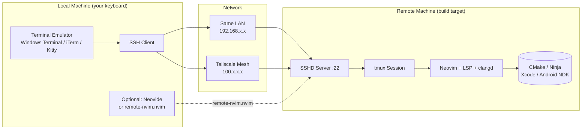
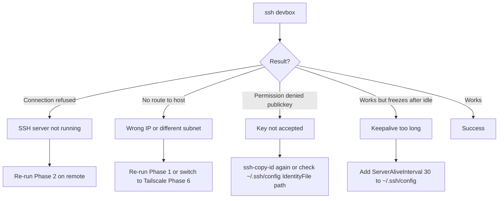

# Remote Development Master Guide

> **Unified cross-platform manual for running Neovim on a remote machine from any local OS.**  
> Covers Windows, macOS, and Linux interop. Copy-paste ready. Every step includes a verification command.

[]()
[](https://neovim.io)
[](https://github.com/tmux/tmux)

---

## What This Solves

You have **two machines** on the same desk, same room, or same house:

| Machine Role | Typical OS | Why it is the target |
|--------------|------------|---------------------|
| **Workstation / PC** | Windows 11 + WSL2, or native Linux | Raw CPU power, NVIDIA GPU, large RAM |
| **MacBook** | macOS | Xcode, iOS builds, Apple Silicon per-core performance |
| **Linux laptop** | Ubuntu / Arch / Fedora | Native Linux toolchain, containers |
| **Mini PC / NUC** | Any | Silent 24/7 build server |

You want to **edit and build on the powerful or SDK-specific machine** while sitting at the keyboard of the other.  
This guide shows the **simplest, most reliable path** for every OS combination.

---

## Architecture



> **Core principle:** SSH is the transport. tmux is the persistence layer. Neovim runs **natively on the target**, so LSP, headers, and toolchains never cross the network.

---

## Decision Matrix

Pick your **local** OS (rows) and **remote** OS (columns). Each cell tells you the best workflow.

| Local ↓ / Remote → | 🍎 macOS | 🐧 Linux (native) | 🪟 Windows (WSL2) |
|---|---|---|---|
| **🍎 macOS** | `ssh` + `tmux` | `ssh` + `tmux` | `ssh` + `tmux` |
| **🐧 Linux** | `ssh` + `tmux` | `ssh` + `tmux` | `ssh` + `tmux` |
| **🪟 Windows (PowerShell)** | `ssh` + `tmux` via Windows Terminal | `ssh` + `tmux` via Windows Terminal | `ssh` + `tmux` into WSL2 |
| **🪟 Windows (WSL2)** | `ssh` + `tmux` from WSL | `ssh` + `tmux` from WSL | `ssh` into sibling WSL |

**The answer is always `ssh` + `tmux`.** Every OS ships an SSH client. No plugins required. No port forwarding. No GUI forwarding latency. tmux survives Wi-Fi drops and laptop sleeps.

---

## Phase 0 — One-Time Prerequisites

Run these once on **each** machine that will participate.

### 🍎 macOS (both local and remote)

```bash
# 1. Xcode command-line tools (provides git, clang, ssh, sshd)
xcode-select --install

# 2. Homebrew
/bin/bash -c "$(curl -fsSL https://raw.githubusercontent.com/Homebrew/install/HEAD/install.sh)"

# 3. Core tools
brew install neovim git cmake ninja fzf fd ripgrep lazygit tmux nmap

# 4. Verify
nvim --version | head -1
tmux -V
ssh -V
```

> Verification output should look like:
> ```
> NVIM v0.10.x
> tmux 3.x
> OpenSSH_9.x
> ```

### 🐧 Ubuntu / Debian / WSL2

```bash
# 1. Update base system
sudo apt update && sudo apt upgrade -y

# 2. Core toolchain
sudo apt install -y neovim git cmake ninja-build fzf fd-find ripgrep tmux \
    curl wget openssh-client openssh-server iproute2

# 3. lazygit (follow official if apt version is stale)
LAZYGIT_VERSION=$(curl -s "https://api.github.com/repos/jesseduffield/lazygit/releases/latest" | grep -Po '"tag_name": "v\K[^"]*')
curl -Lo lazygit.tar.gz "https://github.com/jesseduffield/lazygit/releases/latest/download/lazygit_${LAZYGIT_VERSION}_Linux_x86_64.tar.gz"
tar xf lazygit.tar.gz lazygit
sudo install lazygit /usr/local/bin

# 4. Verify
nvim --version | head -1
tmux -V
ssh -V
```

### 🪟 Windows Native (PowerShell)

Use **Windows Terminal** + **PowerShell** or **WSL2**. Native Windows SSH client is sufficient for the local side; you do **not** need PuTTY.

```powershell
# 1. Ensure OpenSSH client is installed (Windows 10 1809+ ships it)
Get-WindowsCapability -Online | Where-Object Name -like 'OpenSSH*'

# If "NotPresent", install:
Add-WindowsCapability -Online -Name OpenSSH.Client~~~~0.0.1.0

# 2. Windows Terminal (Microsoft Store) recommended for Unicode / tmux key chords

# 3. Verify
ssh -V
```

---

## Phase 1 — Discover the Remote IP

Run **on the remote machine** (the one you will SSH into):

<table>
<tr><th>OS</th><th>Command</th><th>Expected output</th></tr>
<tr>
<td>🍎 macOS</td>
<td><code>ipconfig getifaddr en0</code></td>
<td><code>192.168.1.42</code></td>
</tr>
<tr>
<td>🐧 Linux / WSL2</td>
<td><code>hostname -I | awk '{print $1}'</code></td>
<td><code>192.168.1.42</code></td>
</tr>
<tr>
<td>🪟 Windows (PowerShell)</td>
<td><code>(Get-NetIPAddress -AddressFamily IPv4 | Where-Object { $_.IPAddress -match "192\.168" }).IPAddress</code></td>
<td><code>192.168.1.42</code></td>
</tr>
</table>

> **Note:** `en0` is Wi-Fi on most Macs. If on Ethernet, try `en1` or run `ifconfig` to find the active interface.

**Verify reachability from the local machine:**

```bash
ping -c 4 192.168.1.42    # macOS / Linux
ping -n 4 192.168.1.42    # Windows PowerShell
```

All packets should reply. If they do not, both machines are likely on different subnets or Wi-Fi bands (e.g., 2.4 GHz vs 5 GHz guest isolation). Use Tailscale (Phase 6) to bypass this entirely.

---

## Phase 2 — Enable the SSH Server on the Remote

### 🍎 macOS Remote

```bash
sudo systemsetup -setremotelogin on

# Verify
sudo launchctl list | grep com.openssh.sshd
# or
sudo ss -tlnp | grep :22
```

Expected: `tcp LISTEN 0 128 *.22 *.*`

### 🐧 Linux / WSL2 Remote

```bash
sudo apt install -y openssh-server
sudo systemctl enable ssh --now   # native Linux
sudo service ssh start            # WSL2 (no systemd)

# Verify
sudo ss -tlnp | grep :22
```

Expected: `0.0.0.0:22` or `:::22`.

<details>
<summary><b>🛠️ WSL2 fix: SSH only bound to 127.0.0.1</b></summary>

If `ss` shows `127.0.0.1:22`, Windows cannot reach it from another machine.

```bash
echo "ListenAddress 0.0.0.0" | sudo tee -a /etc/ssh/sshd_config
sudo service ssh restart
sudo ss -tlnp | grep :22
```
</details>

### 🪟 Windows Native as Remote (not recommended)

If the remote is native Windows, install OpenSSH Server:

```powershell
Add-WindowsCapability -Online -Name OpenSSH.Server~~~~0.0.1.0
Start-Service sshd
Set-Service -Name sshd -StartupType 'Automatic'
```

> For C++ development, **prefer WSL2 or a Linux VM** on Windows. Native Windows SSH + MSVC headers over remote sessions is fragile. This guide focuses on macOS and Linux/WSL2 remotes.

---

## Phase 3 — First Connection & Passwordless Auth

All commands below run on the **local machine**.

### Step 3.1 — First login (password)

```bash
# Replace 'your_username' and '192.168.1.42' with real values
# your_username = output of `whoami` on the REMOTE machine
ssh your_username@192.168.1.42
```

Type `yes` when asked to trust the host fingerprint. Enter the remote user's password.

**Verify:** the prompt changes to the remote hostname. Run `hostname` and `whoami`.

### Step 3.2 — Generate an SSH key (once per local machine)

```bash
ssh-keygen -t ed25519 -f ~/.ssh/id_devbox -N ""
```

This creates:
- `~/.ssh/id_devbox` — private key (never leaves this machine)
- `~/.ssh/id_devbox.pub` — public key (safe to copy anywhere)

### Step 3.3 — Copy the public key to the remote

```bash
ssh-copy-id -i ~/.ssh/id_devbox.pub your_username@192.168.1.42
```

Re-enter the remote password one final time.

### Step 3.4 — Verify passwordless login

```bash
ssh -i ~/.ssh/id_devbox your_username@192.168.1.42 echo "auth_ok"
```

Expected output: `auth_ok` with no password prompt.

---

## Phase 4 — SSH Config (never type the IP again)

On the **local machine**, create or edit `~/.ssh/config`:

```ssh-config
Host devbox
    HostName 192.168.1.42
    User your_username
    IdentityFile ~/.ssh/id_devbox
    IdentitiesOnly yes
    ServerAliveInterval 30
    ServerAliveCountMax 3
    TCPKeepAlive yes
```

> **Field reference:**
> - `Host` — your alias. Any word you like (`mac-build`, `wsl-pc`, `linux-nuc`).
> - `HostName` — the IP from Phase 1.
> - `User` — username on the remote.
> - `IdentityFile` — path to the private key.
> - `ServerAliveInterval` — prevents firewalls/NAT from dropping idle connections (sends keepalive every 30 s).
> - `IdentitiesOnly` — forces SSH to use only the specified key, avoiding "too many authentication failures" when you have many keys.

**Verify:**

```bash
ssh devbox echo "config_works"
```

Expected: `config_works` instantly, no IP typed, no password asked.

---

## Phase 5 — Persistent Neovim Session with tmux

This is the production workflow. It survives:
- Wi-Fi drops
- Laptop closing the lid
- Rebooting the local machine

### Step 5.1 — Connect and create a named session

```bash
ssh devbox
cd ~/your-project
tmux new -s cpp
nvim .
```

### Step 5.2 — Inside Neovim (remote)

All LSP, clangd, CMake, and builds run **on the remote natively**:

```vim
" Generate build files (Xcode example — requires macOS remote)
:!cmake --preset macos -G Xcode

" Build
:!cmake --build --preset macos

" Open terminal inside nvim
:term
```

### Step 5.3 — Detach and re-attach (the magic)

| Action | Command |
|--------|---------|
| Detach (keep everything running) | `Ctrl+b` then `d` |
| Re-attach later from anywhere | `ssh devbox` → `tmux attach -t cpp` |
| List sessions | `tmux ls` |
| Kill session | `tmux kill-session -t cpp` |

> **Why tmux instead of `nohup` or `&`?** tmux preserves window dimensions, scrollback, multiple panes, and re-attaches cleanly. `nohup nvim` loses UI state and is hard to recover.

### Step 5.4 — tmux keymap cheat sheet

| Action | Keys |
|--------|------|
| Split horizontal | `Ctrl+b` `"` |
| Split vertical | `Ctrl+b` `%` |
| Switch pane | `Ctrl+b` `arrow` |
| Scroll mode | `Ctrl+b` `[` then arrows / `q` to quit |
| Rename window | `Ctrl+b` `,` |

---

## Phase 6 — Cross-Network & WAN (Tailscale)

If the machines are **not on the same Wi-Fi** (different rooms with isolated VLANs, different cities, coffee shop → home), use Tailscale. It creates a zero-config encrypted mesh VPN.

### Install on **both** machines

```bash
curl -fsSL https://tailscale.com/install.sh | sh
sudo tailscale up
```

Authenticate in the browser link printed by the command.

### Get the stable Tailscale IP

On the **remote** machine:

```bash
tailscale ip -4
```

Output looks like `100.64.123.45`. This IP never changes.

### Update SSH config

Edit `~/.ssh/config` on the local machine:

```ssh-config
Host devbox
    HostName 100.64.123.45      # <- replaced
    User your_username
    IdentityFile ~/.ssh/id_devbox
    IdentitiesOnly yes
    ServerAliveInterval 30
```

**Verify:** `ssh devbox echo "tailscale_ok"` works from any network worldwide. No port forwarding, no dynamic DNS, no firewall rules.

> Docs: [Tailscale SSH](https://tailscale.com/kb/1193/tailscale-ssh) [Tailscale Install](https://tailscale.com/kb/1017/install)

---

## Phase 7 — Optional: GUI Local UI with Remote Server

If you want **local font rendering**, **native clipboard**, or a **GUI Neovim wrapper** (e.g., Neovide) while still running the editor core remotely:

### Option A: `remote-nvim.nvim` (plugin-based)

Install on the **local** Neovim only:

```lua
-- lua/plugins/remote.lua
return {
  {
    "amitds1997/remote-nvim.nvim",
    version = "*",
    dependencies = {
      "nvim-lua/plenary.nvim",
      "MunifTanjim/nui.nvim",
      "nvim-telescope/telescope.nvim",
    },
    config = true,
  },
}
```

Usage:

```vim
:RemoteStart     -- pick host from SSH config, bootstraps remote nvim
:RemoteStop      -- disconnect
:RemoteCleanup   -- remove remote setup
```

Under the hood:
1. SSH into the target
2. Download Neovim AppImage if missing
3. `rsync` your `~/.config/nvim` to the remote
4. Start headless `nvim --listen` on the remote
5. Pipe UI events over SSH

### Option B: `neovide` + `nvr` (manual, advanced)

On the remote, inside tmux:

```bash
export NVIM_LISTEN_ADDRESS=/tmp/nvim_sock
nvim .
```

On the local, tunnel the socket:

```bash
ssh -L /tmp/local_nvim:/tmp/nvim_sock devbox
```

Then open Neovide locally pointed at the tunneled socket. This is expert-level; prefer Option A or the standard tmux workflow.

### When to use GUI forwarding vs tmux-native

| Situation | Recommendation |
|-----------|----------------|
| Same room, fast LAN | tmux-native (Phase 5). Zero latency. |
| High-latency / WAN (>80 ms) | tmux-native. TUI redraws tolerate latency better than GUI streaming. |
| You need local 4K font rendering | `remote-nvim.nvim` or Neovide socket tunnel. |
| Building iOS on Mac from Linux PC | tmux-native. Xcode tools run natively on the Mac. |

---

## Troubleshooting Flowchart



### Quick Fix Index

| Symptom | Cause | Fix |
|---------|-------|-----|
| `Connection refused` | sshd not started | `sudo systemctl start ssh` or `sudo service ssh start` |
| `Permission denied (publickey)` | Key not on remote | Re-run `ssh-copy-id` from Phase 3.3 |
| `No route to host` | IP changed / different VLAN | Re-run Phase 1, or use Tailscale Phase 6 |
| `bind: Address already in use` | tmux session name taken | `tmux ls` then attach, or `tmux kill-session -t cpp` |
| `cmake: command not found` on remote | Tools not installed | Run Phase 0 prerequisites on the **remote** |
| `clangd: missing standard headers` | Running on wrong OS | Ensure Neovim is running **on the target OS**, not locally. LSP must see the target's sysroot. |
| tmux shows `0:bash*` but nvim is gone | Process crashed OOM | Check `dmesg` on remote for OOM killer; increase swap or reduce parallelism. |

---

## Copy-Paste Checklist

Use this before every new project or new machine pair.

```bash
# === LOCAL MACHINE ===
# [ ] 1. SSH client installed
ssh -V

# [ ] 2. Key generated
ls ~/.ssh/id_devbox ~/.ssh/id_devbox.pub

# [ ] 3. SSH config has Host alias
grep -A5 "Host devbox" ~/.ssh/config

# === REMOTE MACHINE ===
# [ ] 4. SSH server listening on 0.0.0.0:22
sudo ss -tlnp | grep :22

# [ ] 5. Neovim installed
nvim --version | head -1

# [ ] 6. tmux installed
tmux -V

# [ ] 7. Build tools installed
cmake --version
ninja --version
clangd --version

# === CONNECTIVITY ===
# [ ] 8. Passwordless SSH works
ssh devbox echo ok

# [ ] 9. tmux session created
ssh devbox -t tmux new -ds cpp
ssh devbox -t tmux ls

# [ ] 10. Open project
ssh devbox
cd ~/your-project
tmux attach -t cpp
nvim .
```

All 10 checks green? You are ready.

---

## References & Further Reading

| Topic | Link |
|-------|------|
| OpenSSH official manual | [ssh(1)](https://man.openbsd.org/ssh.1), [sshd(8)](https://man.openbsd.org/sshd.8), [ssh_config(5)](https://man.openbsd.org/ssh_config.5) |
| Tailscale documentation | [Install guide](https://tailscale.com/kb/1017/install), [Tailscale SSH](https://tailscale.com/kb/1193/tailscale-ssh) |
| tmux wiki | [GitHub wiki](https://github.com/tmux/tmux/wiki) |
| Neovim remote plugins | [remote-nvim.nvim](https://github.com/amitds1997/remote-nvim.nvim) |
| Neovide (GUI) | [neovide.dev](https://neovide.dev/) |
| LazyVim ssh issue | [LazyVim #1581](https://github.com/LazyVim/LazyVim/issues/1581) |
| Existing repo docs | [ssh_remote_dev.md](ssh_remote_dev.md), [remote_nvim_workflow.md](remote_nvim_workflow.md) |

---

## One-Line Summary

> `ssh devbox` → `tmux attach -t cpp`. That's it. Everything else is optimization.
